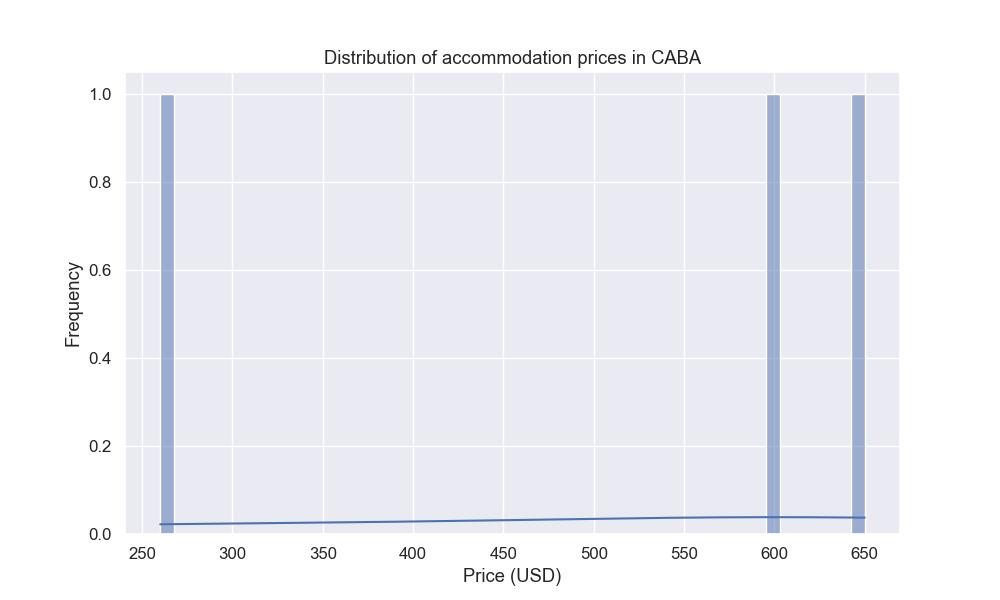
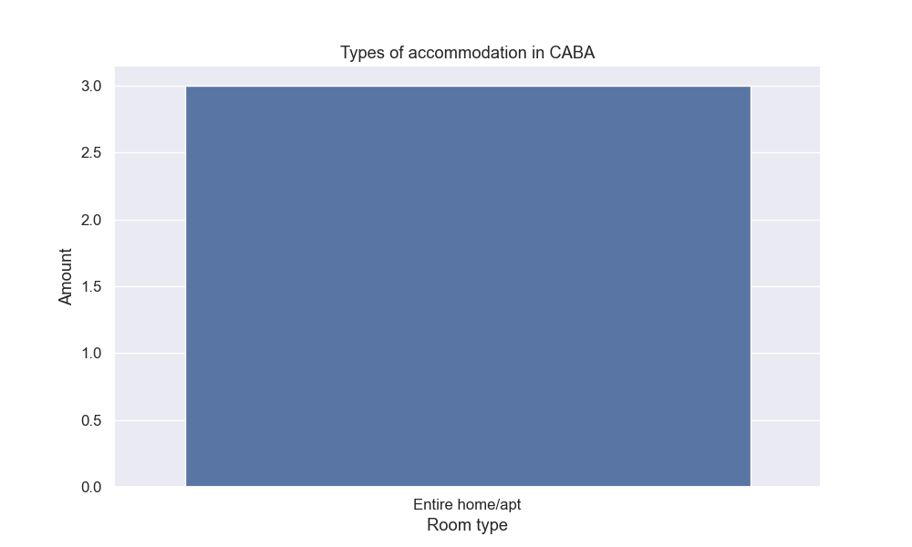
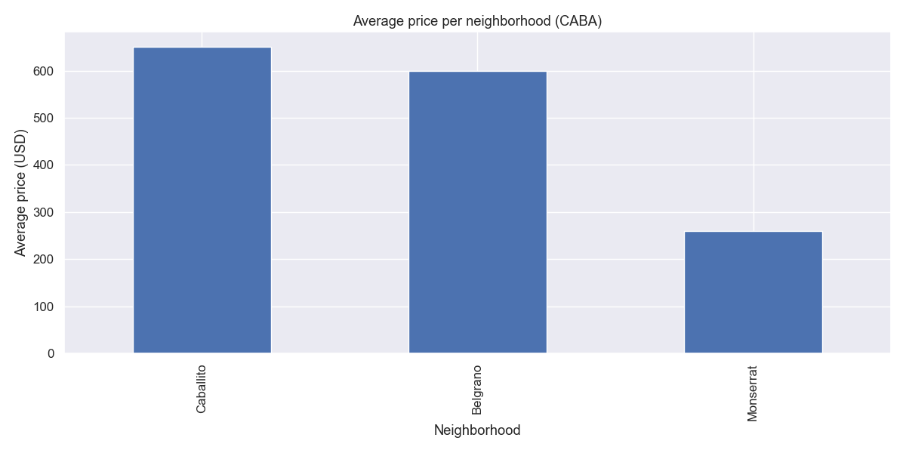
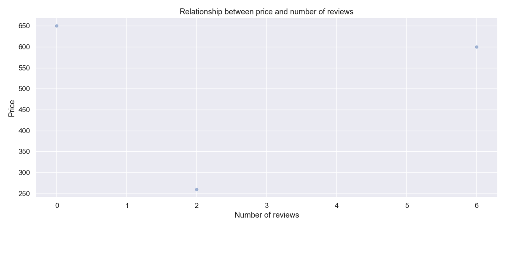
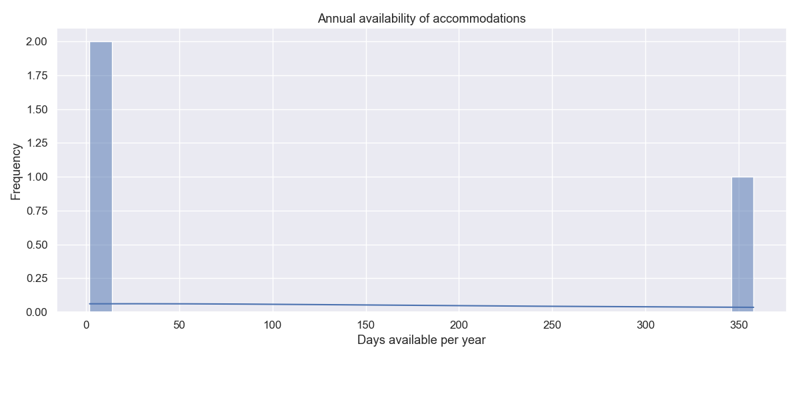

# 🏠 Airbnb Accommodation Analysis in Buenos Aires (CABA)

## 📌 Introduction

This project analyzes data on Airbnb accommodations in the Autonomous City of Buenos Aires (CABA). The main objective is to understand price behavior, the geographic distribution of the most expensive accommodations, the annual availability of properties, and other key variables such as room type and the number of reviews each accommodation receives.

This analysis aims to provide an overview that can be useful for both potential hosts and travelers interested in understanding the local market.

## ❓ Research Questions

This exploratory analysis seeks to answer the following key questions:

- 📈 ***What is the price distribution of accommodations in Buenos Aires (CABA)?**
- 🛏️ ***What type of room is most common in the city?**
- 🗺️ ***Which neighborhoods have the highest average prices?**
- 💬 ***Is there a relationship between the price of an accommodation and the number of reviews it has?**
- 📅 ***What is the annual availability of accommodations (how many days per year are they available)?**

## 📊 3. Desarrollo del análisis exploratorio

Below are the answers to the research questions, accompanied by visualizations generated from the cleaned dataset.

❓ What is the price distribution of accommodations?
The price distribution is skewed to the left, with a majority of properties priced below $500 USD. To prevent extreme values ​​from distorting the analysis, prices above $1,000 USD were filtered out.

This shows that the most common offer is between $200 and $400 USD, which is the typical range for accommodations in Buenos Aires.

❓ What type of room is most common?
There is a clear preference for full accommodations, such as apartments or entire houses.

The "Entire home/apt" room type dominates the distribution, followed by private rooms. This suggests a market orientation toward tourists who prefer independence and comfort.

❓ Which neighborhoods are the most expensive?
The average price per neighborhood was calculated. The results reveal a strong concentration of high prices in traditionally tourist-oriented neighborhoods or those with high purchasing power.

Among the most expensive are Puerto Madero, Palermo, and Recoleta, all neighborhoods with a strong presence in the short-term rental market.

❓ Is there a relationship between price and number of reviews?
The relationship between the number of reviews and the price of the accommodations was analyzed. The resulting graph shows a highly dispersed cloud of points.

No clear linear relationship is evident, although it can be inferred that cheaper accommodations tend to receive more reviews, perhaps due to a higher booking volume.

❓ What is the annual availability of the accommodations?
We explored how many days per year the accommodations are available. A dual pattern was observed: many accommodations are available year-round, while others are available only for a few days.

This indicates a combination of hosts dedicated exclusively to rentals and others who offer them for limited periods (for example, during holidays or events).

✅ Conclusions

The exploratory analysis of Airbnb listings in the Autonomous City of Buenos Aires (CABA) identified important patterns in the local market:

🔍 Most listings are priced under $500 USD, with a typical range between $200 and $400 USD, which sets a benchmark for those wishing to compete in this market.

🏠 The most common room type is full-service accommodation, indicating a strong preference among travelers for options that offer privacy and independence.

📍 The neighborhoods with the highest prices are Puerto Madero, Palermo, and Recoleta, areas with a high tourist or residential profile, with greater attractiveness and purchasing power.

💡 No clear correlation was observed between price and number of reviews, although more affordable properties tend to have more reviews, possibly due to higher booking frequency.

📆 There are two types of hosts: those who are fully available year-round (permanent rentals) and those who list their properties occasionally (temporary or event-based rentals).

This analysis offers a useful first approximation for both hosts who want to better position their properties and visitors looking to understand the available options in different areas of the city.